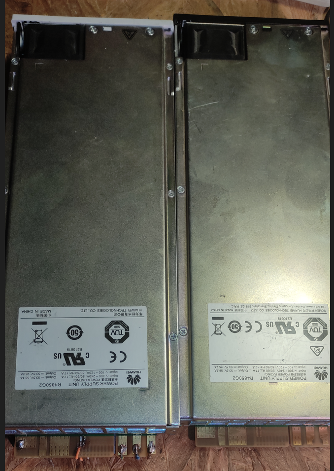
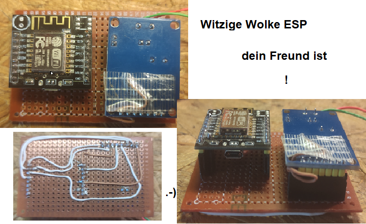

# Esp-HuaweiR4850-Controller 

Das Huawei R4850G2 Rectifier Modul ist ein 3000Watt Lade Netzteil.  
Es kann über CAN Datenkommunikation gesteuert werden.  
Die Software "Esp-HuaweiR4850-Controller" auf einen ESp8266 geflasht, kann dieses Huawei dann steuern.  
Bei der Betriebsart Auto HttpClient(Shelly3EM) wird der Überschuss automatisch direkt vom Shelly nach dem Stromzähler ausgelesen und der Überschusswert dem Huawei zum Laden an DC Ausgang übergeben .  
Wann der Shelly wert über die gewählten Phasen(checkboxen in Webgui) größer minus 10watt beträgt,  
wird die ESP Steuerung das Huawei alles an Strom bis zu -10watt an den DC Ausgang übergeben .  
In meinem Fall ist der DC Ausgang, die Batterie .  
 
!!!  
Das erste vor inbetriebnahme ist: in der Webgui auf "Offline" die Spannung und Strom einstellen(anschliessend Save) , bei mir 57V und 3A .  
Damit kann an die Batterie angeschlossen werden ohne das es funkt!  
!!!  
   
Die genaue Beschreibung folgt noch, derweil musst du meine Videos anschauen :-) *g   
da wird zum Großteil erklärt aber den meisten dürfte eh klar sein wie es funktioniert  
Einsteiger und Infosuchende  -> https://www.youtube.com/playlist?list=PLc1_U57CnlNgIBs_kg-ngtAFJLtnEw9wy  
 
Software bekommt aber noch letzten Schliff , viele netter Features ...

Ps.: Die "Online" Lade Spannung für die Regelung wird bei allen Schnittstellen ausser der VA Schnittstelle in der Webgui eingestellt(anschliessend Save), der Strom fürs Huawei wird dann Berechnet aus der übergebenen Leistung(derzeit noch ohne Effizienz optimierung)
  
Falls Ihr mich unterstützen wollt, Spenden zum Projekt und Projekten sind herzlich   willkommen und würde mich sehr freuen uhund kommen in jedem Fall gut an :-)  
Projekt Spende Gerne Hier bitte - https://paypal.me/BSGuy  

Wie das Huawei angeschlossen wird  
https://youtu.be/9vzZ8Jc1Yzs  

Was nett wäre, Vergesst bitte nicht meinen Kanal zu abonnieren und zu liken ;-) ... wann disliken gut wär, dann das auch :-))  
https://www.youtube.com/c/BavarianSuperGuy  

Ich hab nun ein weisses R4850G2 noblerweise gespendet bekommen, daß hat scheints genau die genau die 
gleiche Grundplatine wie meine schwarzen Netzteile.  
Das weisse funktioniert AUCH, habs kurz mit Spannungsregelung und auslesen getestet.  
Sieht man an den Leiterbahn anschlüssen UNTEN im nachfolgenden Bild(links weiss , rechts schwarz) ,  
die Leiterbahnen sind genau gleich geformt und groß.  
Denke das ist ein indikat um sich ein Netzteil für den Kauf auszusuchen, damit es auch funktionieren wird.  
Garantie ist es keine , es gibt verschiedene Versionen.  
Das weisse Netzteil wurde in Alibaba gekauft und war sehr dreckig und genutzt , auch mit kleinen Hitze schäden  
ALSO Vorsicht beim Kauf!  
Das weisse von mir gereinigte Netzteil wird mein Testschwein und in künftigen Videos auf YT,  
gequält zu sehen sein :-)!  
 
  

Ich übernehme keine Haftung für Schäden, die aufgrund der Nutzung 
der Software entstehen oder entstanden sind. 
Jeder ist für sein tun selber verantwortlich.
Mir sind keine Probleme bekannt.

Vorab zum ESP8266 ein Hinweis!  
zu 100% Lauffähig ist die hier eingestellte Software mit einem ESP12F Modul!
Dieses ESP12F Modul gibt es als e,f oder s Variante.
Diese haben immer ein Abschirmblech verbaut und haben 4MByte(32Mbit) Ram!
In der Regel haben D1 minis oder NodeMcu Platinen das ESP12F Modul verbaut!
Diese funktionieren in der Regel auch gut aber die usbserial programmiereinrichtung 
die mit auf der platine zum ESP12F Modul verbaut wird , ist teils oer meist störanfällig!
Diese z.B. ch340 verbauten IC sind mit dem rx/tx des esp8266 im ESP12F Modul verbunden.
Die Entkopplung von RX/TX ist den D1/Node Platinen Herstellern nicht immer gelungen!
Ich verwende für produktiven Betrieb die "Witzigen Wolke esp" (lichtsensor und led wird davon abgelötet)
ohne die angesteckte Programmierplatine!

Das ist ein perfektes Teil und günstig zu bekommen  :-)  
https://www.google.com/search?q=witzige+wolke+esp   

GANZ UNTEN IST DAS ANSCHLUSSSCHEMA für CAN Bus zu ESP12F D1 Modul(Bastelplan3192)

3 Dinge sind wichtig für die Umsetzung dieses Projekts:
- 3,3V
- Guter Wlan Empfang(Keine Leerzeichen in der SSID vom Router)
- Readme vollstandig lesen, dann nochmal lesen --> 1+1=2x lesen
wann readme gelesen wurde und ihr daraufhin gemerkt habt
aufgrund der Methode die beschrieben wird ,
der wlan empfang ist schlecht und lässt sich nicht ändern(da hilft 3x lesen auch nix)

... https://www.google.com/search?q=esp8266+antennenhack

ich kann keinen besseren Empfang programm-Biern!
und der esp kann auch nix anderes machen wann er ständig versucht sich  ins Wlan einzuloggen

Internet Explorer wird nicht unterstützt!(GLUMP) ab Edge(Chrome Kern) funzt es wieder

aktuelle Version mit manueller Einstellmöglöichkeit  

ESP:

EINRICHTUNG##############################################################################################
- 0.Bei Nutzung von Mqtt: Mqtt.fx Client öffnen mit Broker verbinden und Topic : 'Huawei/#' abonnieren
- 0.1 Es kommt nach Schritt 8. ein Info Publish vom Esp mit der IP adresse.
- 0.2 Man kann die Ip Adresse nat. auch auf dem herkömmlichen Weg herausfinden
- 1.Firmware auf den gelöschten Esp8266 flashen
- 2.Esp Neustart
- 3.Im Wlan nach HUAWEI_... suchen
- 4.Wlan mit Passwort 12345678 verbinden
- 5.Es öffnet sich automatisch Browser Fenster mit 192.168.4.1
- 6.Unter Configuration
- 6.1 Wifi auswählen oder eingeben und Passwort eingeben
- 7.Speichern mit dem Button ganz unten
- 8.Esp Neustart
- 9.Ipadresse in Mqtt Client oder Router ausfindig machen
EINRICHTUNG#############################################################################################

INBETRIEBNAHME##########################################################################################
- 1.Ipaddresse im browser aufrufen
- 2.L1L2L3 Topic von geöffneter Webseite in deinen iobroker/nodered ... übernehmen
ODER wann Nutzung von Mqtt aus ist :
- 3.IPADRESS:80/L1L2L3Auto?Value=-200.66
- 3.1 IPADRESS durch die ip vom ESP ersetzen, -200.66 stellt den kummulierten Wert deiner 2/3 phasen da
- 4 Bei Shelly3em Betriebsart , dei Betriebsart im blauen Bereich auswählen und die IpAdresse vom Shelly angeben
	anschliessend auf Übernehmen klicken 
INBETRIEBNAHME##########################################################################################

CONFIGPORTAL############################################################################################
Um im Nachhinein wieder ins Configportal zu kommen um die Wlan und Mqtt Daten zu ändern muss der 
- Pin RST vom ESP innerhalb 10sekunden 2X auf GND getippt werden
- Anwendungsbispiel: Taster 2mal hintereinander drücken
Daraufhin startet der ESP neu ins Configportal(EINRICHTUNG Punkt 3) , dort trägt man dann alle Daten neu ein, die fehlen
und klickt auf Save (Button ganz unten)
CONFIGPORTAL############################################################################################

Tip:
-  nur leistungsdaten über L1L2L3 (egal welches Interface) senden
wann sich was geändert hat ! Der esp ansich schickt schon jede sekunde den zuletzt angenommenen Wert.

!!!!!!!!!!!!!!!!!!!!!!!!!!!!!!!!!!!!!!!!!!!!!!!!!!!!!!!!!!!!!!!!!!!!!!!!!!!!!!!!!!!!!!!!!!!!!!!!!!!!!!!!!!!!!!!!!!!!!!!!!!!!!!!!

Allgemeiner Hinweis : als L1L2L3 Wert wird ein numerischer Wert wie z.B. 200.66 
oder -200.66 erwartet (Dezimaltrenner ist punkt) und muss immer den reelen/aktuellen Verbrauch darstellen!
 z.B. L1L2L3 = L1(100)+L2(200)+L3(-300) =0
 
 0 wird übergeben!
!!!!!!!!!!!!!!!!!!!!!!!!!!!!!!!!!!!!!!!!!!!!!!!!!!!!!!!!!!!!!!!!!!!!!!!!!!!!!!!!!!!!!!!!!!!!!!!!!!!!!!!!!!!!!!!!!!!!!!!!!!!!!!!!

- 1.Mqtt L1L2L3 Publish Setting : Qos0 (fire & forget)
- 2.Wenn WebInterface L1L2L3Auto?Value=200.66... genutzt wird dann schon alle sekunden senden

########################################################################

END HINWEIS(NICHT nur die harten, kommen in den Garten) :

Wann du von L1 L2 oder L3 nichts wissen willst oder sowieso GENERAL die Schnauze voll hast 
- Kauf dir nen shelly3em
- Bau ihn oder lass ihn fachmännisch im HAK einbauen
- In der Esp Web Gui wählst du shelly client
- In der Esp Web Gui gibst du die IP Adresse vom shelly3em ein
- In der Esp Web Gui drückst du noch auf übernehmen und restart

und schon wirds wieder RUHIG im DachstÜbchen! :-)
Zeit fürs Bier gewonnen!

###################################################################+####

Bastelplan für Anschluss von Esp12F(Esp8266, D1 Mini) an MCP2515  
mit einfacher Modifikation des MCP2515 Boards.  
Damit wird dem Can Transceiver IC eine eigene Spannungsversorgung zu geben.  
Diese Verschaltung wird für den Betrieb des Huawei R4850 zum Esp benötigt.  

#LifePO4 AC 48V Charger (43V -58.5V)