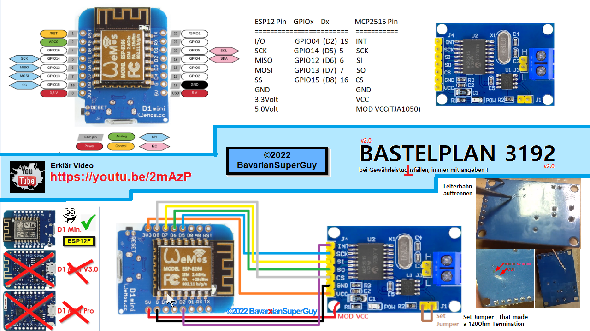

# Esp-HuaweiR4850-Controller 

Das Huawei R4850G2 Recitfier Modul ist ein 3000Watt Lade Netzteil.  
Es kann über Datenkommunikation gesteuert werden.  
Die noch in der Entwicklung befindliche Software "Esp-HuaweiR4850-Controller" kann dieses Huawei dann steuern.  
Manuell: funktioniert bereits, siehe weiter unten Sceenshot Weboberfläche...  
   Auto: Implementiere ich warsch. alle Schnittstellen wie beim Soyo Controller  

Der Huawei R4850G2 Controller ist noch in Arbeit , es wird wieder was feines :-)  
Wie das Huawei angeschlossen wird , dazu kommt noch getrennt ein Video und   
natürlich wird es in dieser Dokumentation dargestellt. 

Erste Einblicke gibt es auf Youtube  
https://www.youtube.com/playlist?list=PLc1_U57CnlNgIBs_kg-ngtAFJLtnEw9wy  

Was nett wäre, Vergesst bitte nicht meinen Kanal zu abonnieren und zu liken ;-) ... wann disliken gut wär, dann das auch :-))  
https://www.youtube.com/c/BavarianSuperGuy  

Falls Ihr mich unterstützen wollt, Spenden zum Projekt und Projekten sind herzlich   willkommen und würde mich sehr freuen uhund kommen in jedem Fall gut an :-)  
Hier bitte - https://paypal.me/BSGuy  

Ich übernehme keine Haftung für Schäden, die aufgrund der Nutzung 
der Software entstehen oder entstanden sind. 
Jeder ist für sein tun selber verantwortlich.
Mir sind keine Probleme bekannt.

Vorab zum ESP8266 ein Hinweis!
zu 100% Lauffähig ist die hier eingestellte Software mit einem ESP12F Modul!
Dieses ESP12F Modul gibt es als e,f oder s Variante.
Diese haben immer ein Abschirmblech verbaut und haben 4MByte(32Mbit) Ram!
In der Regel haben D1 minis oder NodeMcu Platinen das ESP12F Modul verbaut!
Diese funktionieren in der Regel auch gut aber die usbserial programmiereinrichtung 
die mit auf der platine zum ESP12F Modul verbaut wird , ist teils oer meist störanfällig!
Diese z.B. ch340 verbauten IC sind mit dem rx/tx des esp8266 im ESP12F Modul verbunden.
Die Entkopplung von RX/TX ist den D1/Node Platinen Herstellern nicht immer gelungen!

GANZ UNTEN IST DAS ANSCHLUSSSCHEMA für CAN Bus zu ESP12F D1 Modul(Bastelplan3192)

3 Dinge sind wichtig für die Umsetzung dieses Projekts:
- 3,3V
- Guter Wlan Empfang(Keine Leerzeichen in der SSID vom Router)
- Readme vollstandig lesen, dann nochmal lesen --> 1+1=2x lesen
wann readme gelesen wurde und ihr daraufhin gemerkt habt
aufgrund der Methode die beschrieben wird ,
der wlan empfang ist schlecht und lässt sich nicht ändern(da hilft 3x lesen auch nix)

... https://www.google.com/search?q=esp8266+antennenhack

ich kann keinen besseren Empfang programm-Biern!
und der esp kann auch nix anderes machen wann er ständig versucht sich  ins Wlan einzuloggen

Internet Explorer wird nicht unterstützt!(GLUMP) ab Edge(Chrome Kern) funzt es wieder

aktuelle Version mit manueller Einstellmöglöichkeit  

HIERRENNNNNNN

Bastelplan für Anschluss von Esp12F(Esp8266, D1 Mini) an MCP2515  
mit einfacher Modifikation des MCP2515 Boards.  
Damit wird dem Can Transceiver IC eine eigene Spannungsversorgung zu geben.  
Diese Verschaltung wird für den Betrieb des Huawei R4850 zum Esp benötigt.  

#LifePO4 AC 48V Charger (43V -58.5V)